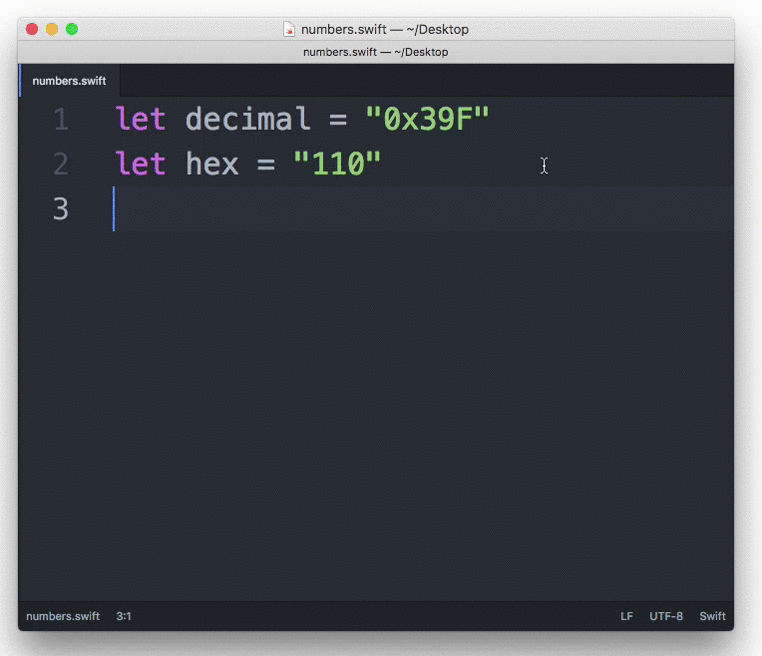

# HexIt

Decimal to/from Hexadecimal Converter for Atom.



## Install

With the Atom Package Manager:

```bash
apm install hex-it
```

You can also install it directly from Atom:

> Settings ➔ Packages ➔ Search for `hex-it`

## Usage

- Convert the selection to hexadecimal with <kbd>CTRL</kbd>-<kbd>Shift</kbd>-<kbd>H</kbd>
- Convert the selection to hexadecimal with a `0x` prefix with <kbd>CTRL</kbd>-<kbd>ALT</kbd>-<kbd>Shift</kbd>-<kbd>H</kbd>
- Convert the selection to decimal with <kbd>CTRL</kbd>-<kbd>Shift</kbd>-<kbd>D</kbd>
